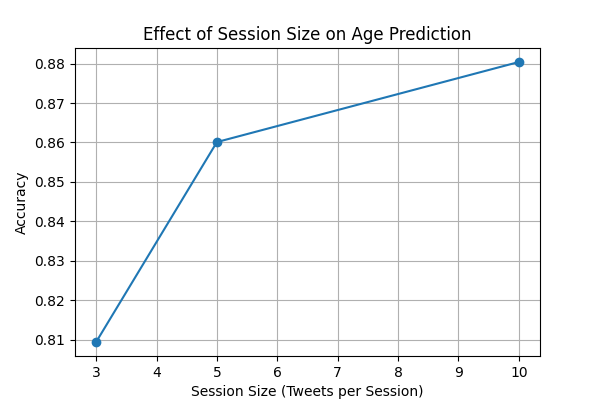
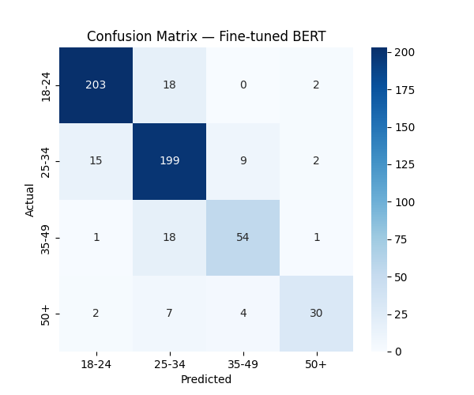

# Beyond Single Posts: Session-Level Modeling for Document-Level Text Analysis in Social Media


---

## 📄 Paper

This repository accompanies the research paper:

**Beyond Single Posts: Improving Age Prediction with Session-Level Modeling of Social Media Text**

> This work investigates whether aggregating multiple tweets into sessions improves demographic (age) prediction compared to single-post modeling.

---

## 🔍 Overview

Predicting demographic attributes from social media text is a challenging NLP task because individual posts often contain limited stylistic information.

This project explores whether **aggregating multiple tweets into sessions** provides richer context and improves prediction performance.

---

## 🎯 Research Question

> **Does aggregating multiple tweets into sessions improve demographic prediction compared to single tweet classification?**

---

## 📊 Dataset

This project uses the **PAN Author Profiling dataset**, a benchmark dataset for demographic inference.

* ~152 authors
* ~100 tweets per author
* ~14,000 total tweets

### Age Groups

* 18–24
* 25–34
* 35–49
* 50+

---

## 🧠 Input Representations

### Single Tweet

Each tweet is treated independently:

```
good morning everyone!
```

---

### Tweet Session

Multiple tweets are aggregated:

```
tweet1 [SEP] tweet2 [SEP] tweet3 [SEP] tweet4 [SEP] tweet5
```

This captures:

* writing style
* vocabulary patterns
* punctuation usage
* behavioral signals

---

## 🤖 Models Evaluated

| Model                                 | Representation | Description                   |
| ------------------------------------- | -------------- | ----------------------------- |
| TF-IDF + Logistic Regression          | Tweet          | Lexical baseline              |
| TF-IDF + Logistic Regression          | Session        | Context aggregation baseline  |
| BERT Embeddings + Logistic Regression | Session        | Frozen transformer embeddings |
| BERT Fine-tuned                       | Tweet          | Transformer (single tweet)    |
| BERT Fine-tuned                       | Session        | Transformer (session-based)   |

---

## 📈 Main Results

| Model                | Input   | Accuracy | Macro F1 |
| -------------------- | ------- | -------- | -------- |
| TF-IDF + LR          | Tweet   | 0.64     | 0.57     |
| TF-IDF + LR          | Session | 0.78     | 0.73     |
| BERT Embeddings + LR | Session | 0.67     | 0.60     |
| BERT Fine-tuned      | Tweet   | 0.71     | 0.65     |
| BERT Fine-tuned      | Session | **0.86** | **0.83** |

---

## 🔬 Session Size Ablation

| Session Size | Accuracy  | Macro F1  |
| ------------ | --------- | --------- |
| 3 Tweets     | 0.809     | 0.743     |
| 5 Tweets     | 0.860     | **0.825** |
| 10 Tweets    | **0.880** | 0.814     |

📌 Insight:

* Increasing context improves performance
* Gains diminish beyond 5 tweets

---

## 📊 Visualizations

### Session Ablation



### Confusion Matrix (Best Model)



---

## 🔑 Key Findings

* Session-based modeling significantly improves age prediction
* Context aggregation is a strong signal for demographic inference
* Fine-tuned BERT outperforms classical methods
* Adjacent age groups remain difficult to distinguish

---

## 📂 Project Structure

```
session-age-profiling/

data/
   raw/
   processed/

experiments/
   (logs, extra runs)

results/
   final_results.csv
   session_ablation_results.csv

figures/
   bert_session_confusion_matrix.png
   session_ablation_plot.png

src/
   models/
      baseline_lr.py
      bert_embeddings.py
      bert_finetune.py

   analysis/
      plot_results.py

   run_all_experiments.py

notebooks/
   bert_experiments.ipynb

requirements.txt
README.md
```

---

## ⚙️ Installation

```bash
git clone https://github.com/MdZakiAfzal/session-age-profiling.git
cd session-age-profiling
pip install -r requirements.txt
```

---

## ▶️ Running Experiments

```bash
python src/run_all_experiments.py
```

---

## 📓 Notebook

```
notebooks/bert_experiments.ipynb
```

Includes:

* dataset preparation
* training
* evaluation
* visualization

---

## 🔁 Reproducibility

To reproduce results:

1. Prepare dataset using `src/data/`
2. Run baseline models:

   ```bash
   python src/models/baseline_lr.py
   ```
3. Run BERT experiments using the notebook

---

## 🚀 Future Work

* Incorporate user metadata
* Explore multilingual datasets
* Use larger language models
* Extend to other demographic attributes

---

## 📌 Citation

```
@misc{session_age_profiling,
  title={Beyond Single Posts: Improving Age Prediction with Session-Level Modeling of Social Media Text},
  author={Anonymous Authors},
  year={2026},
  note={Under review at NLP 2026}
}
```

---
