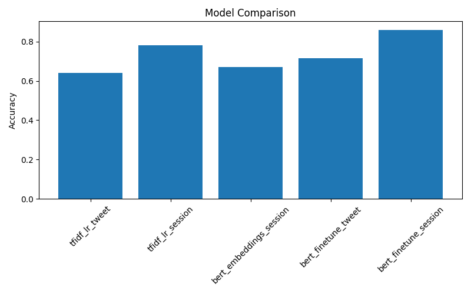

# Session-Based Age Prediction from Social Media Text


Predicting demographic attributes from social media text is a challenging NLP task because individual posts contain limited stylistic signals.

This project investigates whether **aggregating multiple tweets into sessions improves age prediction performance** compared to single tweets.

We evaluate several classical machine learning and transformer-based models using the **PAN Author Profiling dataset**.

---

# Project Overview

The central research question explored in this project is:

> **Does aggregating multiple tweets into sessions improve demographic prediction compared to single tweet classification?**

Two input representations are studied:

* **Single Tweet**
* **Tweet Session (multiple tweets concatenated)**

The hypothesis is that **sessions capture richer stylistic and lexical signals**.

---

# Dataset

The project uses the **PAN Author Profiling dataset**, a benchmark dataset for demographic inference.

Each author contains approximately **100 tweets** with age labels.

### Age Groups

* 18–24
* 25–34
* 35–49
* 50+

---

# Input Representations

## Single Tweet

Each tweet is treated as an independent training sample.

Example:

```
good morning everyone!
```

---

## Tweet Session

Five tweets from the same author are aggregated.

```
tweet1 [SEP] tweet2 [SEP] tweet3 [SEP] tweet4 [SEP] tweet5
```

This provides stronger signals for:

* vocabulary patterns
* punctuation style
* emoji usage
* code mixing

---

# Models Evaluated

| Model                                 | Representation | Description                           |
| ------------------------------------- | -------------- | ------------------------------------- |
| TF-IDF + Logistic Regression          | Tweet          | Lexical baseline                      |
| TF-IDF + Logistic Regression          | Session        | Context aggregation baseline          |
| BERT Embeddings + Logistic Regression | Session        | Frozen transformer embeddings         |
| BERT Fine-tuned                       | Tweet          | Transformer trained on single tweets  |
| BERT Fine-tuned                       | Session        | Transformer trained on tweet sessions |

---

# Results

| Model                | Input   | Accuracy | Macro F1 |
| -------------------- | ------- | -------- | -------- |
| TF-IDF + LR          | Tweet   | 0.64     | 0.57     |
| TF-IDF + LR          | Session | 0.78     | 0.73     |
| BERT Embeddings + LR | Session | 0.67     | 0.60     |
| BERT Fine-tuned      | Tweet   | 0.71     | 0.65     |
| BERT Fine-tuned      | Session | **0.86** | **0.83** |

---

# Model Performance



The chart above shows that **session-based modeling significantly improves performance** compared to single tweets.

---

# Confusion Matrix (Best Model)


The confusion matrix illustrates prediction performance of the **fine-tuned BERT session model**.

---

# Key Findings

1. Aggregating tweets into sessions significantly improves age prediction performance.

2. Frozen transformer embeddings are not sufficient for this task.

3. Fine-tuned BERT models outperform classical approaches.

4. Session aggregation allows models to capture **stylistic signals across multiple tweets**.

---

# Project Structure

```
session-age-profiling

data/
   raw/
   processed/

results/
   final_results.csv

figures/
   model_comparison.png
   bert_confusion_matrix.png

src/
   models/
      baseline_lr.py
      bert_embeddings.py
      bert_finetune.py

   analysis/
      plot_results.py

   run_all_experiments.py

notebooks/
   bert_experiments.ipynb

requirements.txt
README.md
```

---

# Installation

Clone the repository:

```
git clone https://github.com/yourusername/session-age-profiling.git
cd session-age-profiling
```

Install dependencies:

```
pip install -r requirements.txt
```

---

# Running Experiments

Run the full experiment pipeline:

```
python src/run_all_experiments.py
```

This script runs:

* TF-IDF baseline models
* BERT embedding baseline
* BERT fine-tuning (tweets)
* BERT fine-tuning (sessions)

---

# Notebook

The notebook demonstrates the core experiment comparing tweet-based and session-based BERT models.

```
notebooks/bert_experiments.ipynb
```

It includes:

* dataset preparation
* BERT training
* evaluation
* confusion matrix visualization

---

# Reproducibility

All experiments can be reproduced using the scripts in `src/`.

Key features:

* deterministic train/test splits
* consistent preprocessing pipeline
* reusable experiment scripts

---

# Future Work

Possible extensions of this research include:

* incorporating user metadata
* experimenting with larger transformer architectures
* multilingual author profiling
* predicting additional demographic attributes

---

# Citation

If you use this work, please cite:

```
@misc{session_age_profiling,
  title={Session-Based Age Prediction from Social Media Text},
  author={Md Zaki Afzal},
  year={2026},
  url={https://github.com/MdZakiAfzal/session-age-profiling}
}
```

---

# Author

**Md Zaki Afzal**
Machine Learning Engineer
